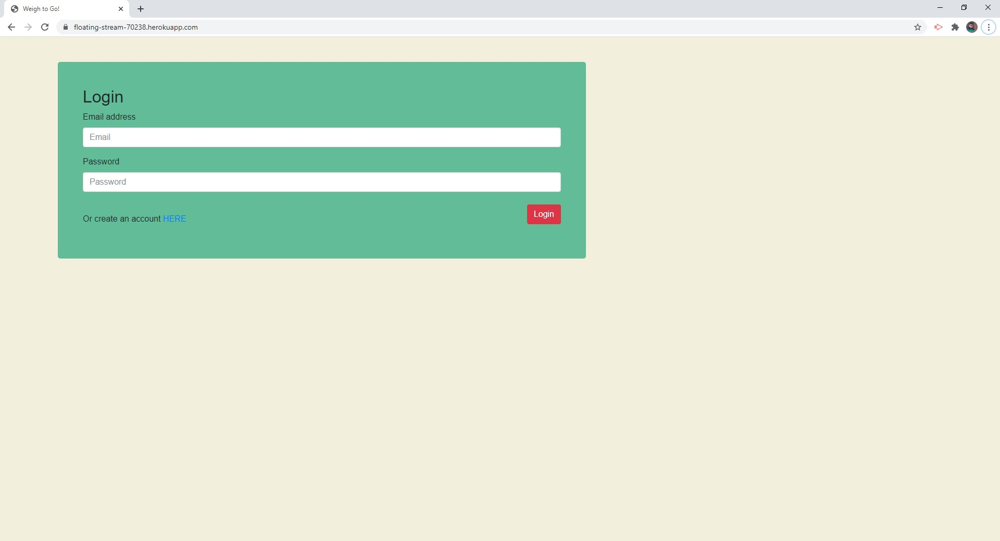

# Weigh to Go!
https://floating-stream-70238.herokuapp.com/

## Demonstration

## Description
Weigh to Go is a food tracker and weight loss calculator to help people achieve their goal weight in a healthy and effective manner. They can enter their daily calorie intake and update their weight in their profile as they go along their weight loss journey. 

## Installation
Step 1 - Make sure you have a code editor, MySQL, Node.js and Node Package Manager installed

Step 2 - Clone my repository

Step 3 - Update the config.json with your username and password for mySQL

Step 5 - Run the node command `npm install` to install all the modules required

Step 6 - Run the node command `npm run devStart`

Step 7 - Start the application on your local server
Type `localhost:3000` in your internet browser. 

Step 8 - Enjoy!

## Credits
We used Passport.js to run our authentication.

## Contributing
### Team 6 - Narcissus
*Sunny Babal* 
*Grant Scriver* 
*Regan Murray* 
*James Jorissen* 
*Caroline Pukenis*
